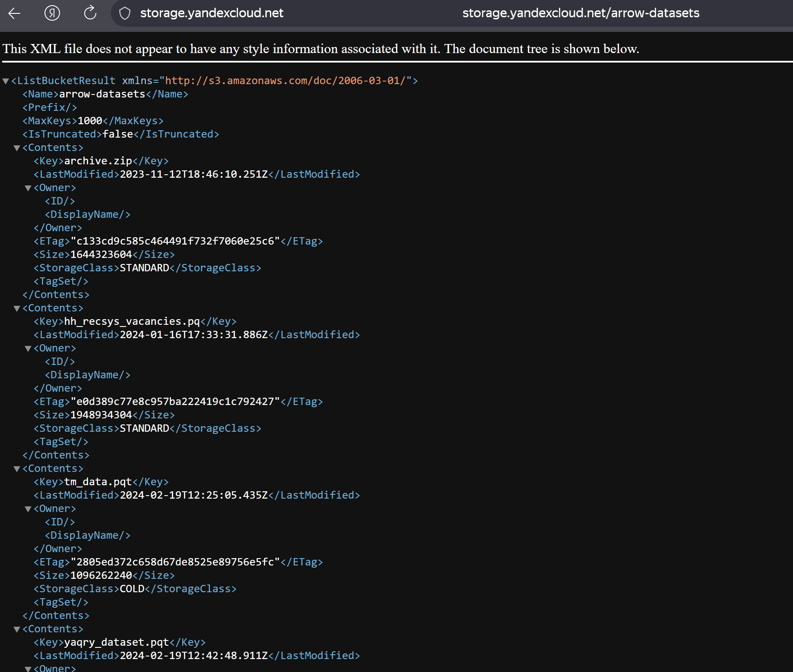
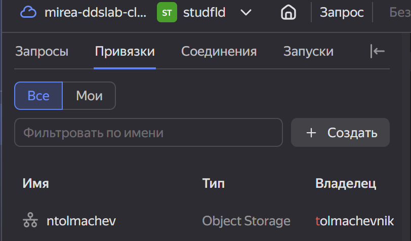
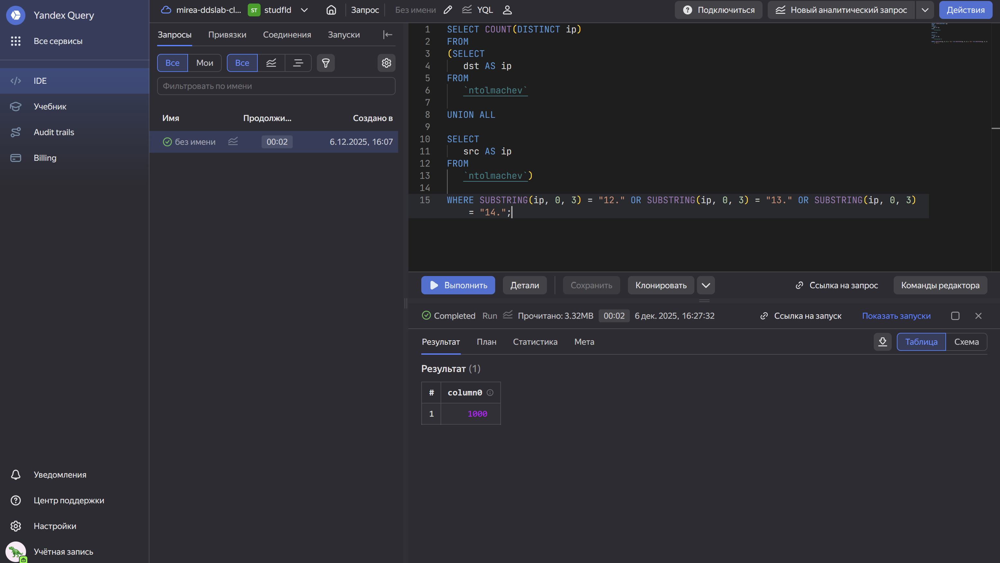
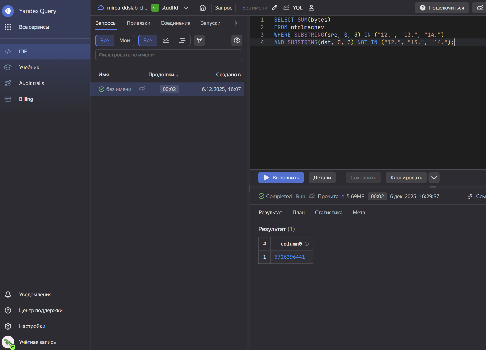
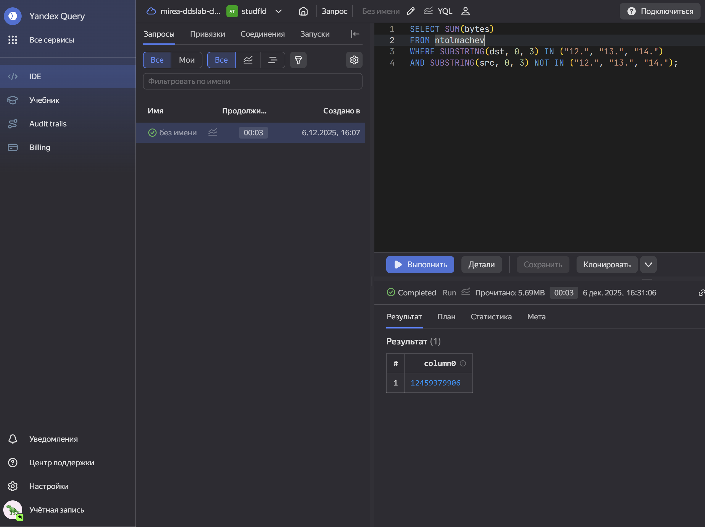

# Практическая работа 7
tolmachevnikita04@yandex.ru

## Цель работы

1.  Изучить работу сервиса Yandex Query и его возможности при анализе
    структурированных данных.  
2.  Освоить построение аналитического пайплайна на базе сервисов Yandex
    Cloud.  
3.  Закрепить применение SQL для исследования сетевой активности внутри
    сегментированной корпоративной сети.

## Исходные данные

1.  Manjaro Linux  
2.  RStudio Desktop  
3.  Интерпретатор R версии 4.5.1

## Задание

Необходимо подключить Yandex Query к данным, расположенным в Yandex
Object Storage, и при помощи SQL-запросов получить ответы на несколько
аналитических вопросов, связанных с сетевым трафиком.

## Ход работы

1.  Проверить доступность данных в Object Storage  
    1.1. Убедиться, что файл **yaqry_dataset.pqt** доступен в бакете
    **arrow-datasets**.

2.  Настроить подключение в Yandex Query  
    2.1. Создать S3-соединение (указать имя бакета, выбрать публичную
    аутентификацию).  
    2.2. Создать привязку и указать нужный объект в качестве источника
    данных.

3.  Анализ данных  
    3.1. Внутренние IP-адреса имеют первые октеты в диапазоне 12–14.
    Определить число внутренних хостов.  
    3.2. Вычислить общий объём исходящего трафика.  
    3.3. Вычислить общий объём входящего трафика.

### Шаг 1

#### Проверим доступность данных

Переходим по ссылке на бакет и удостоверяемся, что объект присутствует.

### Шаг 2

#### Создание соединения с S3-бакетом

#### Создание и настройка привязки

После подключения просматриваем структуру набора данных:

Убедимся, что привязка успешно создана:

### Шаг 3

#### Определим количество внутренних хостов

Составим следующий запрос:

    SELECT COUNT(DISTINCT ip)
    FROM 
    (SELECT
       dst AS ip
    FROM
       `ntolmachev`

    UNION ALL

    SELECT
       src AS ip
    FROM
       `ntolmachev`)

    WHERE SUBSTRING(ip, 0, 3) = "12." OR SUBSTRING(ip, 0, 3) = "13." OR SUBSTRING(ip, 0, 3) = "14.";

1000 хостов во внутренней сети

#### Определить суммарный объем исходящего трафика.

Составим следующий запрос:

    SELECT SUM(bytes)
    FROM arrow_binding_dolgov
    WHERE SUBSTRING(src, 0, 3) IN ("12.", "13.", "14.")
    AND SUBSTRING(dst, 0, 3) NOT IN ("12.", "13.", "14.");

6726396441 суммарный объём исходящего трафика

#### Определить суммарный объем входящего трафика.

Составим следующий запрос:

    SELECT SUM(bytes)
    FROM ntolmachev
    WHERE SUBSTRING(dst, 0, 3) IN ("12.", "13.", "14.")
    AND SUBSTRING(src, 0, 3) NOT IN ("12.", "13.", "14.");

12459379906 суммарный объем входящего трафика

### Итог

Практическая работа выполнена: данные успешно подключены через Yandex
Query, выполнены SQL-запросы и получены значения по внутренним хостам и
объёмам входящего/исходящего трафика.  
Отчёт оформлен в требуемом формате.

### Вывод

В ходе выполнения работы были закреплены навыки работы с Yandex Query и
S3-хранилищем, а также на практике применён SQL для анализа сетевой
активности. Полученные результаты позволяют лучше понимать структуру
трафика внутри корпоративной сети и могут служить основой для
последующего построения систем мониторинга или выявления аномальной
активности.
