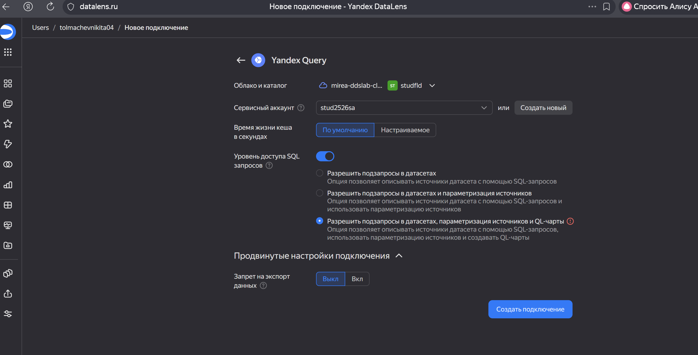
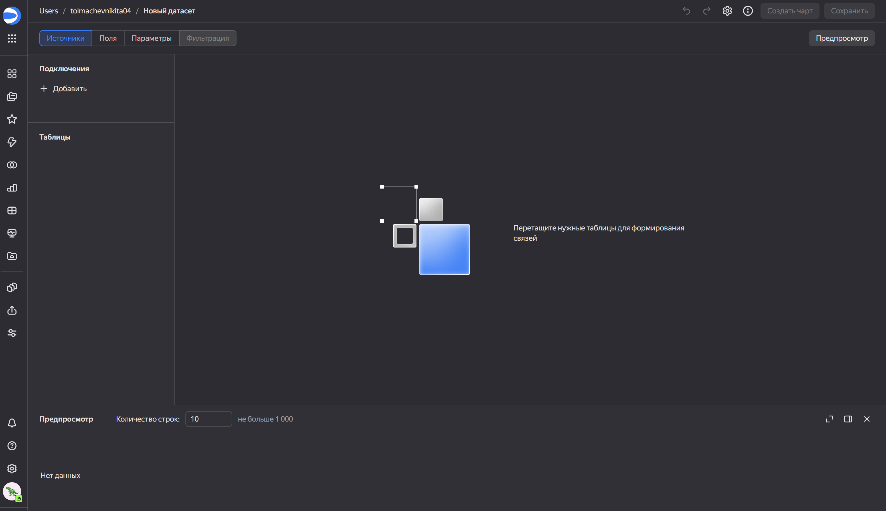
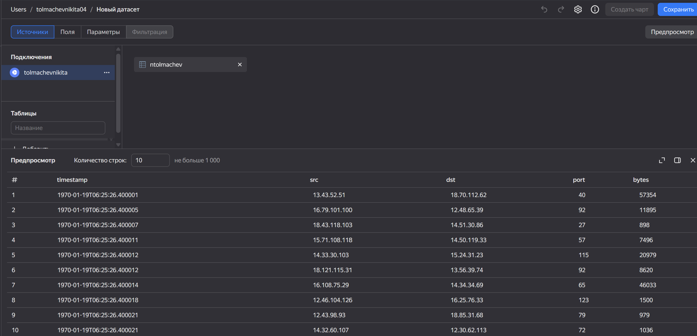
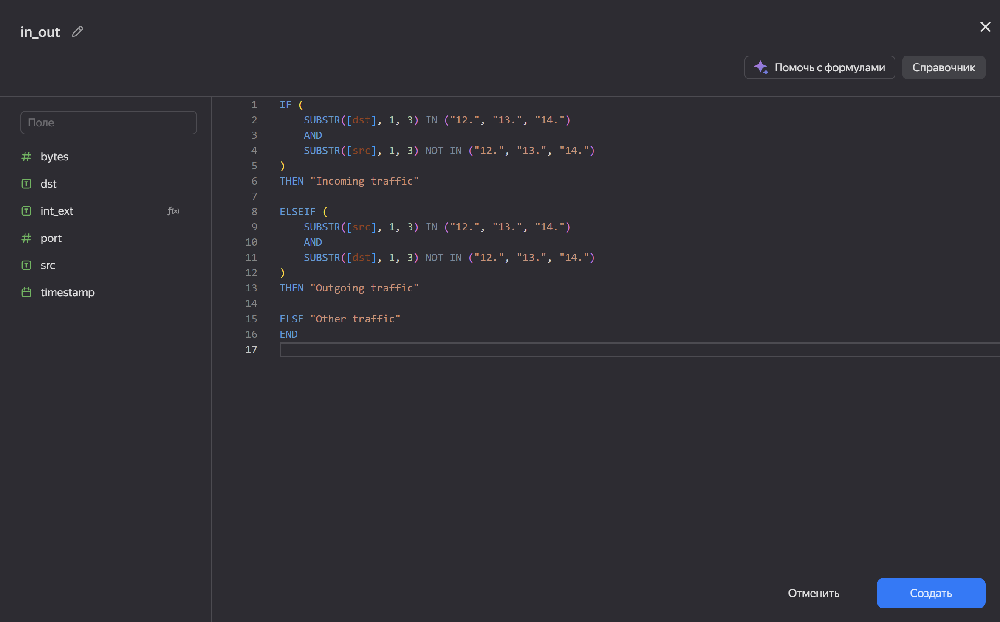
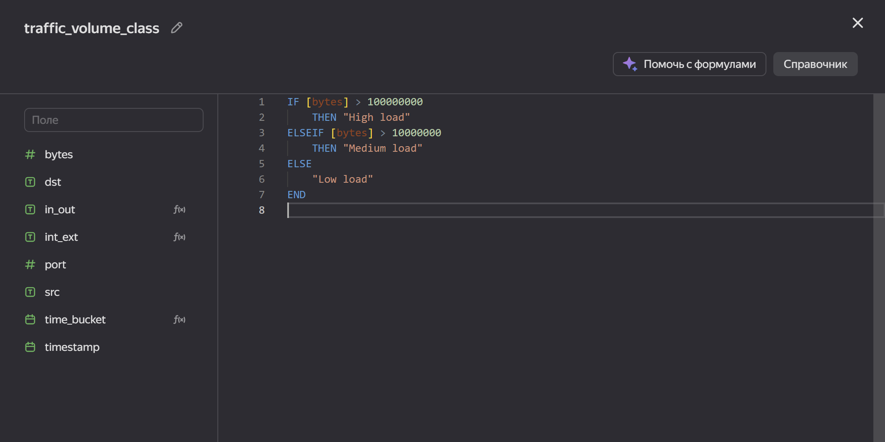
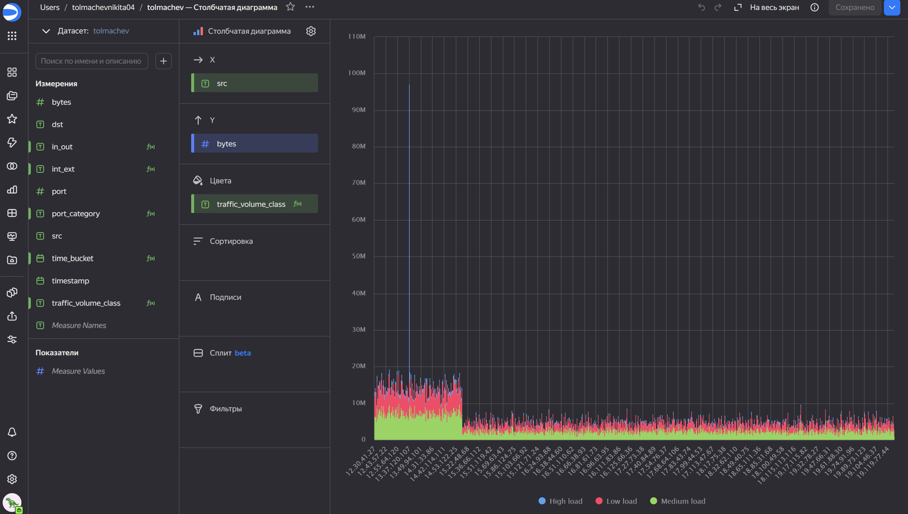
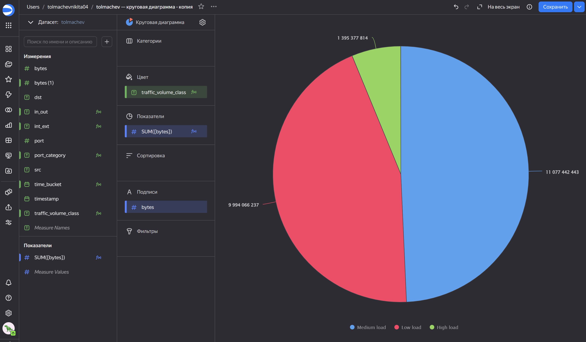
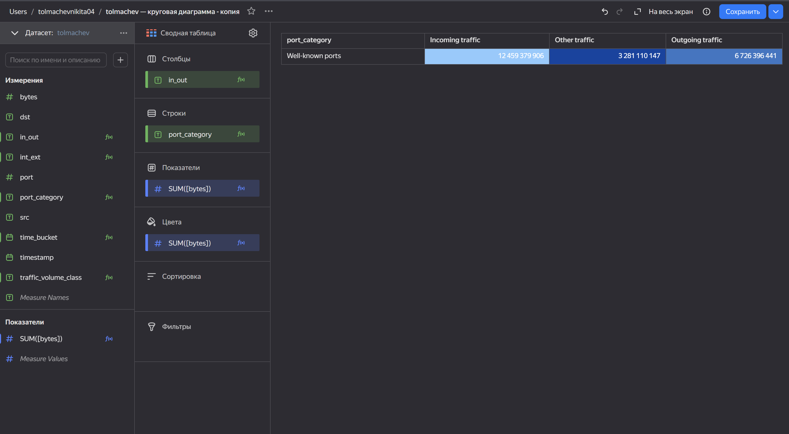
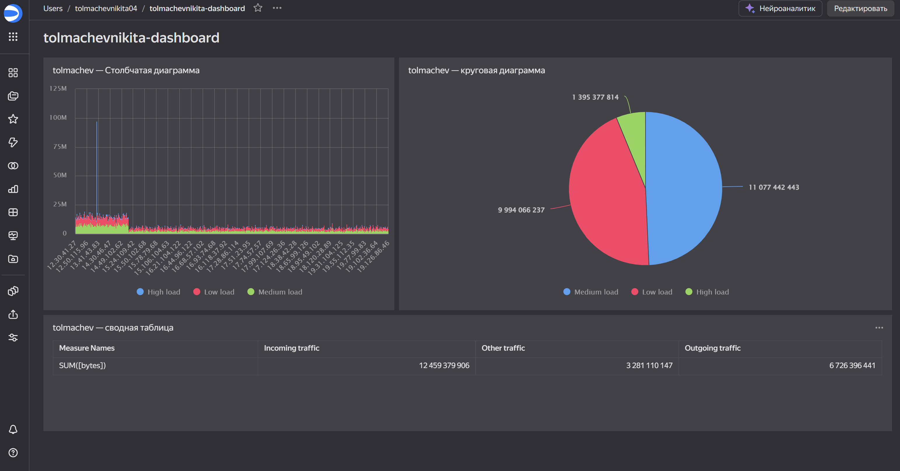

## Цель работы

1. Разобраться с возможностями Yandex DataLens для визуального анализа структурированных данных.  
2. Научиться строить графики и диаграммы для представления результатов анализа сетевого трафика.  
3. Получить практический опыт создания визуальных элементов мониторинга/SIEM на основе DataLens и Yandex Query.  
4. Закрепить практические навыки использования SQL и вычисляемых полей для анализа активности в корпоративной сети.

## Исходные данные

1. Таблица сетевого трафика (timestamp, src, dst, port, bytes).  
2. Среда выполнения: Yandex Query + DataLens.  
3. SQL-данные из предыдущих практических работ.

---

# Шаг 1

## Переходим в Yandex DataLens, создаём новое подключение и проверяем

##Проверяем всё ли создалось

---

# Шаг 2  
## Создаём датасет, подтягиваем таблицу из Yandex Query

---

# Шаг 3  
## Построение визуализаций и создание вычисляемых полей

---

## 3.1. Классификация внутреннего/внешнего трафика

На этом шаге создаётся поле **in_out**, определяющее направление движения трафика — входящий, исходящий или прочий.

##3.2. Создание вычисляемого поля классификации нагрузки по объёму трафика

Формула поля traffic_volume_class:

##3.3. Построение столбчатой диаграммы объёмов трафика с классификацией по нагрузке

##3.4. Построение круговой диаграммы распределения нагрузки трафика

3.5. Сводная таблица — матрица направлений трафика по категориям портов

##Шаг 4 — Итоговый дашборд

[Ссылка на итоговый дашборд](https://datalens.ru/tcmua5txtje8e-tolmachevnikita-dashboard)

##Итог

В ходе работы было выполнено подключение к Yandex Query, создан датасет, произведено вычисление дополнительных аналитических полей и построены три вида визуализаций. Все элементы объединены в полноценный дашборд.

##Вывод

Yandex DataLens позволяет быстро создавать аналитические панели, визуализировать большие массивы сетевых логов и выявлять закономерности: направление трафика, его интенсивность и распределение нагрузки. Полученные навыки применимы при создании систем мониторинга и базовых SIEM-решений.